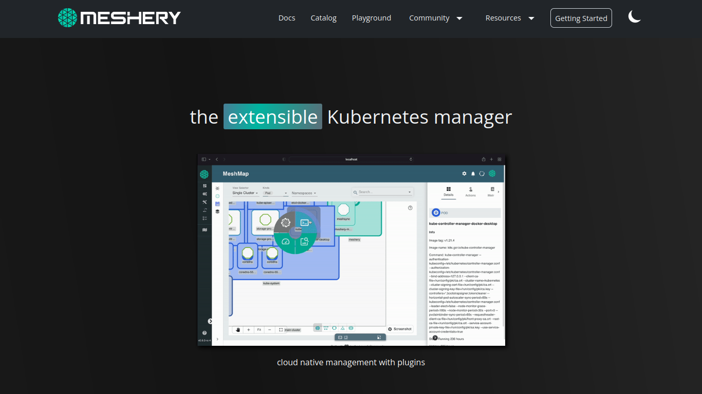

<picture>
  <p style="text-align: center;">
<a href="https://khulnasoft.com/meshplay">
<picture align="center">
<source media="(prefers-color-scheme: dark)" srcset="./assets/images/logos/meshplay-logo-dark-text-side.svg" width="70%" align="center" style="margin-bottom:20px;">
<source media="(prefers-color-scheme: light)" srcset="./assets/images/logos/meshplay-logo-light-text-side.svg" width="70%" align="center" style="margin-bottom:20px;">
 </picture>
</a>

<br/><br/></p>
</picture>

## Meshplay.github.io

<div align="center">

[](https://hub.docker.com/r/khulnasoft/meshplay-github-io)
[](https://goreportcard.com/report/github.com/khulnasoft/meshplay)
[](https://github.com/meshplay/meshplay.github.io/actions/workflows/pages/pages-build-deployment)
[](LICENSE)
[](https://github.com/khulnasoft/meshplay/issues?q=is%3Aopen+is%3Aissue+label%3A"help+wanted")
[](https://khulnasoft.com/meshplay/)
[](https://twitter.com/intent/follow?screen_name=meshplayio)
[](https://discuss.khulnasoft.com)
[](https://slack.meshplay.github.io)
[](https://bestpractices.coreinfrastructure.org/projects/3564)

</div>

<h2>Preview of <a href="https://meshplay.github.io">Meshplay.github.io</a> Website</h2>


_Visit [Meshplay.github.io](https://meshplay.github.io/) to learn more!_

## What is Meshplay?

Meshplay is a self-service engineering platform - the open source, cloud native manager that enables the design and management of all Kubernetes-based infrastructure and applications. Among other features, Meshplay manages multi-cluster Kubernetes deployments. As an extensible platform, Meshplay offers visual and collaborative GitOps, freeing you from the chains of YAML.

For further information, refer to the [Meshplay Docs](https://meshplay.github.io/docs).

<div>&nbsp;</div>

## 💻Tech Stack


## Join the Meshplay community!

<a name="contributing"></a><a name="community"></a>
Our projects are community-built and welcome collaboration. 👍 Be sure to see the <a href="https://khulnasoft.com/community/newcomers/">Newcomers' Guide</a> for a tour of resources available to you and jump into our <a href="https://slack.meshplay.github.io">Slack</a> to engage!

<p style="clear:both;">
<a href ="https://khulnasoft.com/community"></a>
<h3>Find your MeshMate</h3>

<p>MeshMates are experienced KhulnaSoft community members, who will help you learn your way around, discover live projects and expand your community network. 
Become a <b>Meshtee</b> today!</p>

<p>
Find out more about the <a href="https://khulnasoft.com/community#meshmate">KhulnaSoft community</a>. <br />
<br /><br /><br /><br />
</p>
<a href="https://slack.meshplay.github.io">

<picture align="right">
  <source media="(prefers-color-scheme: dark)" srcset="./assets/images/logos/slack-dark-128.png"  width="110px" align="right" style="margin-left:10px;margin-top:10px;">
  <source media="(prefers-color-scheme: light)" srcset="./assets/images/logos/slack-128.png" width="110px" align="right" style="margin-left:10px;padding-top:5px;">
  
</picture>
</a>

<a href="https://meshplay.github.io/community"></a>

<p>

<p>
✔️ <em><strong>Join</strong></em> any or all of the weekly meetings on the <a href="https://calendar.google.com/calendar/b/1?cid=bGF5ZXI1LmlvX2VoMmFhOWRwZjFnNDBlbHZvYzc2MmpucGhzQGdyb3VwLmNhbGVuZGFyLmdvb2dsZS5jb20">community calendar</a>.<br />
✔️ <em><strong>Watch</strong></em> community <a href="https://www.youtube.com/playlist?list=PL3A-A6hPO2IMPPqVjuzgqNU5xwnFFn3n0">meeting recordings</a>.<br />
✔️ <em><strong>Access</strong></em> the <b>Community Drive</b>-by completing a community <a href="https://khulnasoft.com/newcomer">Member Form</a>.<br />
✔️ <em><strong>Discuss</strong></em> in the <a href="https://discuss.khulnasoft.com">Community Forum</a>.<br />
✔️ <em><strong>RSVP</strong></em> to the <a href="https://community.cncf.io/meshplay-community/">CNCF Meshplay Community</a> meetings.<br />
</p>
<p align="center">
<i>Not sure where to start?</i> Grab an open issue with the <a href="https://github.com/issues?q=is%3Aopen+is%3Aissue+archived%3Afalse+org%3Akhulnasoft+org%3Ameshplay+org%3Aservice-mesh-performance+org%3Aservice-mesh-patterns+label%3A%22help+wanted%22+">help-wanted label</a>.
</p>

<div>&nbsp;</div>
<a name="contributing"></a>

## Contributing to the Meshplay.github.io Website

Before contributing, please review the [Contribution Flow](https://github.com/meshplay/meshplay/blob/master/CONTRIBUTING.md). In the following steps, you will setup your development environment, fork and clone the repository, run the site locally, and finally commit, sign off, and push any changes made for review.

### 1. Set up your development environment

- _The Meshplay site is built using Jekyll - a simple static site generator! You can learn more about Jekyll and setting up your development environment in the [Jekyll Docs](https://jekyllrb.com/docs/)._

- First [install Ruby](https://jekyllrb.com/docs/installation/), then install Jekyll and Bundler. ( **Note** : Install the same version of Ruby as mentioned in the [Gemfile](https://github.com/meshplay/meshplay.github.io/blob/master/Gemfile) )

### 2. Get the code

- Fork and then clone the [Meshplay.github.io repository](https://github.com/meshplay/meshplay.github.io)
  ```bash
  $ git clone https://github.com/YOUR-USERNAME/meshplay.github.io
  ```
- cd into project using
  ```bash
  $ cd meshplay.github.io
  ```

### 3. Serve the site

- Serve the code locally
  ```bash
  $ make site
  ```
  _Note: From the Makefile, this command is actually running `$ bundle install; bundle exec jekyll serve --drafts --livereload`_

### 4. Create a Pull Request

- After making changes, don't forget to commit with the sign-off flag (-s)
  ```bash
  $ git commit -s -m “my commit message w/signoff”
  ```
- Once all changes have been committed, push the changes.
  ```bash
  $ git push origin <branch-name>
  ```
- Then on Github, navigate to the [Meshplay.github.io repository](https://github.com/meshplay/meshplay.github.io) and create a pull request from your recently pushed changes.

### Stargazers

<p align="center">
  <i>If you like Meshplay, please <a href="../../stargazers">★</a> star this repository to show your support! 🤩</i>
 <br />
<a href="../../stargazers">
 
</a></p>

#### License

This repository and site are available as open source under the terms of the [Apache 2.0 License](https://opensource.org/licenses/Apache-2.0).

[🔼Back to top](#meshplayio)
