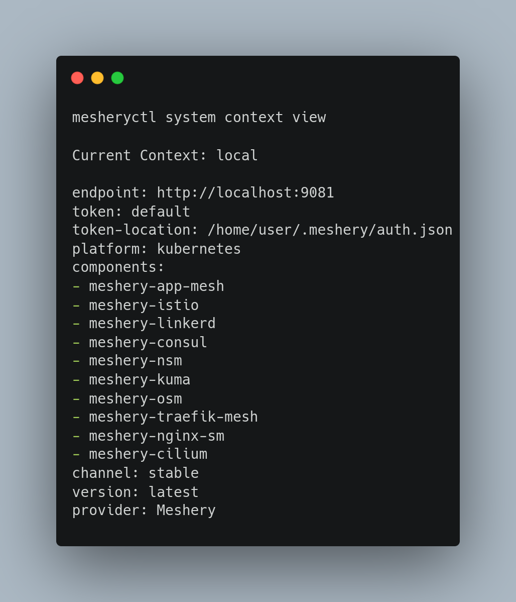

Meshplay is constantly evolving and improving, with new features and bug fixes being added regularly. To stay up to date with the latest Meshplay features and updates, you can switch between different release channels.

  Artifacts of the builds for Meshplay and its components are published under two different release channels, so that improved controls may be provided to both  Meshplay users and Meshplay developers. The two release channels are edge and stable release channels. Relative to stable releases, edge releases occur much more frequently. Edge releases are made with each merge to master, unless that merge to master is for a stable release. Stable releases are made with each
  merge to master when a GitHub release tag is also present in the workflow.

<h2> How release channels offer subscription </h2>

  Release Channels offers a subsciption where user can subscribe to a specific  release channel and get notified when a new release is available. This is  useful for users who want to stay up to date with the latest Meshplay features, while also also providing flexibility for users who want to stay on a specific version of Meshplay.
  However, this approach can be risky because some updates may introduce bugs or compatibility issues that could break your existing installation. Depending upon your risk aversion and the nature of your deployment environment, having a subscription means that you will automatically receive these updates that you might not be ready incorporate.   On the other hand, release channels also offer the ability to pin to a specific release which is a  good thing as it allows users to maintain stability and predictability of their environment by preventing unexpected changes from being introduced into their system. However, doing so cancels out any future subscription-based benefits such as receiving security patches or bug fixes that were added after that version was released.

Therefore, it's important for you to weigh the pros and cons of each option before making decisions on how you want to manage your Meshplay deployment. It's recommended you and your organizations have a well-defined upgrade strategy based on testing and validation procedures prior to applying new releases in production environments whether via subscriptions or manual upgrades to ensure that system availability is maintained and risks are minimized.

To subscribe to a specific release channel or version using meshplayctl you can use 

  <code class="code-box">meshplayctl system channel set [stable|stable-version|edge|edge-version] 
  </code>
    <!-- copy to clipboard -->
    <a class="btn tooltip" style="position: absolute; top:0.10rem; right: 0.5rem; font-size: 22px;" data-clipboard-target="#channelset"
      data-clipboard-text="meshplayctl system channel set [stable|stable-version|edge|edge-version]" onmouseout="resetCopyText(this)">
      <i class="far fa-copy"></i>
      Copy to clipboard
    </a>

This command will update your local Meshplay configuration to use the selected channel for future updates. To set the channel to a specific version, replace Version with the desired version number. Example: 
<code class="code-block">meshplayctl system channel set stable</code>
or <code class="code-block">meshplayctl system channel set stable-v0.5.56</code>

<h2> Switching between Release Channels</h2>

There are two ways to switch between Meshplay release channels: using meshplayctl or by editing your meshconfig file. In this blog post, we'll cover both methods.

<h3>What is Meshconfig?</h3>

  Meshconfig is a configuration file that is used to configure Meshplay. It is typically located in the 
  <code class="code-block">~/.meshplay/config.yaml</code> directory. It contains information about the current release channel, the version of Meshplay that is installed, and other configuration options that are specific to your Meshplay installation. 
  Meshconfig is automatically generated when you run Meshplay for the first time. It is also automatically updated when you update Meshplay

<h3>Switching between Meshplay release channels using meshconfig file.</h3>

Open your terminal and confirm that you have meshplayctl installed by running  
<code class="code-block">meshplayctl version</code>. If you don't have meshplayctl installed, you can install it by following the instructions in the  <a href="https://meshplay.github.io/docs/installation/meshplayctl">Meshplay documentation</a>.

1. Create new Meshplay config.yaml file
 

  <code class="code-box">meshplayctl system context create [context-name]
  </code>
    <!-- copy to clipboard -->
    <a class="btn tooltip" style="position: absolute; top:0.10rem; right: 0.5rem; font-size: 22px;" data-clipboard-target="#contextcreate"
      data-clipboard-text="meshplayctl system context create [context-name]" onmouseout="resetCopyText(this)">
      <i class="far fa-copy"></i>
      Copy to clipboard
    </a>

Example:   <code class="code-block">meshplayctl system context create new-context --components meshplay-istio meshplay-osm meshplay-linkerd --platform docker --url http://localhost:9081 --set --yes </code>

2. To view the newly created meshplay context use
 

  <code class="code-box">meshplayctl system context view [context-name] 
  </code>
    <!-- copy to clipboard -->
    <a class="btn tooltip" style="position: absolute; top:0.10rem; right: 0.5rem; font-size: 22px;" data-clipboard-target="#contextviewname"
      data-clipboard-text="meshplayctl system context view [context-name]" onmouseout="resetCopyText(this)">
      <i class="far fa-copy"></i>
      Copy to clipboard
    </a>

3. After making these changes, you can switch between different context by using 

  <code class="code-box">meshplayctl system context switch 
  </code>
    <!-- copy to clipboard -->
    <a class="btn tooltip" style="position: absolute; top:0.10rem; right: 0.5rem; font-size: 22px;" data-clipboard-target="#contextswitch"
      data-clipboard-text="meshplayctl system context switch" onmouseout="resetCopyText(this)">
      <i class="far fa-copy"></i>
      Copy to clipboard
    </a>

<h3>Switching between Meshplay release channels using meshplayctl.</h3>

meshplayctl is a command-line tool for managing Meshplay. You can use it to switch between different release channels. Here's how:

<ul><li> Run the following command to see the current configuration for Meshplay: </li>
 

  <code class="code-box">meshplayctl system context view 
  </code>
    <!-- copy to clipboard -->
    <a class="btn tooltip" style="position: absolute; top:0.10rem; right: 0.5rem; font-size: 22px;" data-clipboard-target="#contextview"
      data-clipboard-text="meshplayctl system context view" onmouseout="resetCopyText(this)">
      <i class="far fa-copy"></i>
      Copy to clipboard
    </a>

This will show you the currently channels ,<b>stable</b> or <b>edge</b>, along with the version number and other information.

<li> Run the following command to switch to a different release channel:
</li>
 

  <code class="code-box">meshplayctl system channel switch
  </code>
    <!-- copy to clipboard -->
    <a class="btn tooltip" style="position: absolute; top:0.10rem; right: 0.5rem; font-size: 22px;" data-clipboard-target="#channelswitch"
      data-clipboard-text="meshplayctl system channel switch" onmouseout="resetCopyText(this)">
      <i class="far fa-copy"></i>
      Copy to clipboard
    </a>

This command will update your meshconfig file to switch release channel and version of context in focus. To switch the channel to a specific version, replace <b>Version</b> with the desired version number.

<li> To confirm that the channel has been changed, run the following command again:</li>
 

  <code class="code-box">meshplayctl system channel view 
  </code>
    <!-- copy to clipboard -->
    <a class="btn tooltip" style="position: absolute; top:0.10rem; right: 0.5rem; font-size: 22px;" data-clipboard-target="#channelview"
      data-clipboard-text="meshplayctl system channel view" onmouseout="resetCopyText(this)">
      <i class="far fa-copy"></i>
      Copy to clipboard
    </a>

 
</ul>

<h2>Conclusion </h2>

  Switching between Meshplay release channels is a simple and straightforward process. You can do it using meshplayctl or by switching between your meshconfig file. Whether you want stable updates or bleeding-edge features, Meshplay has a release channel that suits your needs. Just remember to carefully consider your use case and needs before making any changes to ensure that you have the best Meshplay experience.

